# Happy path

Redone on `actual_365`. Matches FIN-14 (resolved 2026-08-27: actual/365 platform-wide) and the `day_count_convention` column default.

## Terms → schedule

`rate_for(i) = 19.9% × days_in_period(i) / 365` (`InterestBasis`). Period 1's "prior" is the disbursement date, so the 30-day deferral prices on its real length. D = `2026-09-13`.

| #   | Due        | Days   | Period rate | Opening  | Principal | Interest  | Installment  |
| --- | ---------- | ------ | ----------- | -------- | --------- | --------- | ------------ |
| 1   | 2026-10-13 | 30     | 1.635616 %  | 1,200.00 | 400.00    | 19.63     | **419.63**   |
| 2   | 2026-11-13 | 31     | 1.690137 %  | 800.00   | 400.00    | 13.52     | **413.52**   |
| 3   | 2026-12-13 | 30     | 1.635616 %  | 400.00   | 400.00    | 6.54      | **406.54**   |
|     |            | **91** |             |          | 1,200.00  | **39.69** | **1,239.69** |

vs `nominal_monthly`: 39.80 → **39.69**, 11c less. Period 2 now prices 31/365 instead of a flat 1/12.

`payment_sizing_strategy: discount_factor_sum` is inert here — only `annuity_interest?` reads `level_payment`, and this is `equal_principal`.

## EIR view ≠ contractual view

This is the change that matters. `EffectiveInterestRateCalculator` solves the IRR over **equal-spaced** periods (t = 1, 2, 3), day-agnostic. `AmortisationWalk` then applies that one rate to the carrying amount. The contractual column above is day-aware. They diverge:

EIR = **1.653653 %/period** (×12 = 19.8438 %, compounded 21.7519 %)

| #   | Opening carrying | Payment  | `interest_at_eir` | `principal_at_eir` | Closing | Δ vs contract |
| --- | ---------------- | -------- | ----------------- | ------------------ | ------- | ------------- |
| 1   | 1,200.00         | 419.63   | **19.84**         | 399.79             | 800.21  | +21c          |
| 2   | 800.21           | 413.52   | **13.23**         | 400.29             | 399.92  | −29c          |
| 3   | 399.92           | 406.54   | **6.62**          | 399.92             | 0.00    | +8c           |
|     |                  | 1,239.69 | **39.69**         | 1,200.00           |         | **0**         |

Loan is `eir_integral` → `loan.eir_mode?` true → **the ledger runs entirely on the right-hand column**. `EirAccrualStrategy.eir_interest_by_number` reads `interest_at_eir_cents`; `record_repayment_eir` splits the cash by `eir_principal_interest`. The contractual `installment.interest_cents` column is what the consumer is shown and what sets `amount_cents` — nothing posts it.

Under `nominal_monthly` the two columns were identical (both 19.90 / 13.27 / 6.63), so this divergence is created by the convention switch, not by fees. Zero fees here.

## Daily accrual amounts

`DailyInterestAllocation.for_period` over `interest_at_eir_cents`, remainder öre on the last days.

| Period | `period_start`         | Dates posted        | Split                   | Sum   |
| ------ | ---------------------- | ------------------- | ----------------------- | ----- |
| 1      | 09-13 (`disbursed_at`) | 09-14 → 10-13 (30d) | 66c × 26, then 67c × 4  | 1,984 |
| 2      | 10-13 (due 1)          | 10-14 → 11-13 (31d) | 42c × 10, then 43c × 21 | 1,323 |
| 3      | 11-13 (due 2)          | 11-14 → 12-13 (30d) | 22c × 28, then 23c × 2  | 662   |

91 journal rows, one per `(installment, value_date)`.

## Flow

```mermaid
flowchart TD
    A["OriginateLoanOperation<br/>approved → active, disbursed_at = D"] --> B["disbursement<br/>Dr loan:N:loan_principal 1200.00<br/>Cr platform:consumer_receivable_clearing"]
    B --> B2["consumer_disbursement (order_id nil)<br/>Dr consumer_receivable_clearing<br/>Cr platform:cash:operating_outflow"]
    B2 --> C["RecalculateProvisionOperation<br/>day-0 Stage 1 ECL"]
    C --> C2["EirPersister: loan.eir = 0.01653653<br/>solved equal-spaced over 419.63 / 413.52 / 406.54"]
    C2 --> D["publish LoanOriginated"]
    D --> N

    subgraph N["NIGHTLY — D+1 .. D+91"]
        direction TB
        N1["03:10 daily_interest_accrual"] --> N1a{"loan.servicing?<br/>lock! + re-read"}
        N1a -->|no| N1b["nothing_accrued"]
        N1a -->|yes| N2["EirAccrualStrategy.due_accruals<br/>boundaries D → 10-13 → 11-13 → 12-13<br/>interest from AmortisationScheduleCalculator<br/>1984 / 1323 / 662"]
        N2 --> N3["DailyInterestAllocation<br/>66-67c | 42-43c | 22-23c per day"]
        N3 --> N4{"value_date already posted?"}
        N4 -->|yes| N5["skip"]
        N4 -->|no| N6{"period closed?"}
        N6 -->|closed| N7["skip, report<br/>closed_period_installment_ids"]
        N6 -->|open| N8["interest_accrual<br/>Dr loan:N:loan_interest<br/>Cr platform:interest_revenue<br/>value_date = the day earned"]
        N8 --> N9["03:20 daily_arrears_batch<br/>DPD, SICR stage, provision recalc"]
        N5 --> N9
        N7 --> N9
        N9 --> N10["03:50–04:10 reconciliations<br/>deferred fee, ECL↔ledger, audit chain"]
    end

    N --> P{"due date?"}
    P -->|not yet| N
    P -->|unpaid at 03:20| Q["UpdateArrearsOperation<br/>active → in_arrears, DPD ticks"]
    Q --> R["03:45 dunning reminder<br/>04:00 escalation<br/>ChargeLateFeesOperation"]
    R --> N

    P -->|payment| S["RecordInstallmentPaymentOperation<br/>→ record_repayment_eir"]
    S --> S1["period_for(installment_number)<br/>eir_principal_interest splits the cash"]
    S1 --> S2["ensure_interest_accrued_eir<br/>inline top-up to interest_at_eir_cents<br/>value_date = min(due_date, payment date)"]
    S2 --> S3["Dr platform:cash:operating_inflow<br/>Cr loan_principal 399.79 [repayment_principal]<br/>Cr loan_interest 19.84 [repayment_interest]"]
    S3 --> S4["installment → paid<br/>publish InstallmentPaid"]
    S4 --> T{"all_installments_paid?"}
    T -->|no| N
    T -->|yes| U["mark_loan_paid_off<br/>status = paid_off, closure_reason"]
    U --> V["ReleaseProvisionOperation<br/>exit_reason: :paid_off"]
    V --> W["publish LoanPaidOff<br/>loan_principal 0, loan_interest 0"]

    X["ProcessEarlyRepaymentOperation<br/>backfills unaccrued interest,<br/>reverses EIR uplift, Art 29(2) cap"] -.->|alt| U
```



## Timeline

```
D=09-13   ── 30 accruals ──▶ 10-13   ── 31 accruals ──▶ 11-13  ── 30 accruals ──▶ 12-13
disburse     66c×26,67c×4     due 1     42c×10,43c×21    due 2    22c×28,23c×2    due 3
1200.00      = 19.84          419.63    = 13.23          413.52   = 6.62          406.54
             (1.635616%)                 (1.690137%)               (1.635616%)     paid_off
```

## Recurring tasks

Unchanged from the `nominal_monthly` run — day count affects amounts, not the job graph.

| Time      | Job                                  | This loan                                    |
| --------- | ------------------------------------ | -------------------------------------------- |
| 03:05     | `withdrawal_repayment_reminder`      | Only in the 14-day Art 26(5) window          |
| **03:10** | **`daily_interest_accrual`**         | **91 nights, D+1..D+91**                     |
| 03:15     | `daily_broker_fee_amortisation`      | Only if broker commission capitalised        |
| 03:17     | `daily_origination_fee_amortisation` | No — `eir_integral`, no deferred fee leg     |
| **03:20** | **`daily_arrears_batch`**            | Every night: DPD, stage, provision           |
| 03:22     | `checkout_capture_gap_sweep`         | Read-only                                    |
| 03:25     | `daily_payment_plan_sweep`           | Only if a plan exists                        |
| 03:30     | `overpayment_refunds_payout`         | Only on overpayment                          |
| 03:40     | `daily_settlement_batch`             | Merchant payout side                         |
| 03:45     | `event_dispatch_completeness_sweep`  | Re-dispatch lost events                      |
| 03:50     | `daily_deferred_fee_reconciliation`  | Read-only                                    |
| 04:00     | `daily_reconciliation_batch`         | Subledger ↔ GL                               |
| 04:05     | `verify_ecl_ledger_consistency`      | `provision_amount_cents` vs `loss_allowance` |
| 04:10     | `daily_audit_verification`           | Hash chain over the day                      |
| 04:20     | `daily_cap_staleness_check`          | FR usury cap provenance                      |

Arrears-only: `daily_promise_to_pay_breach_check` 03:00, `daily_dunning_reminder` 03:45, `daily_collections_case_escalation` 04:00.

Monthly period close seals a month; accrual days inside it are skipped permanently (`:period_closed`), never retried.

# Using Straight Fee Line Income Recognition

`income_recognition` is derived at origination and frozen:

- `PricingData#income_recognition` returns `eir_integral` for anything with `interest_cents.positive?` — this shape always.
- `CreateLoanOperation#resolve_income_recognition` demotes it to `straight_line_fee` **only** when `product_data.approximates_effective_interest?`, i.e. the **product** carries `income_recognition_policy: "straight_line_fee"` (ADR-019, 2026-09-02).
- It's in `IMMUTABLE_PRICING_FIELDS` (`loan.rb:114`) — validation rejects any post-creation change.

So it's a product-config decision, not a loan knob. Today only `personal_loan` is flagged (`PERSONAL_LOAN_INCOME_RECOGNITION_POLICY`), Sweden-only. Putting a `cmc_france` BNPL product on it is exactly the default-allow blast radius ADR-019 exists to prevent, and the IAS 8.8 materiality argument is **still unsigned** (FIN-21). ADR-019 also notes no validation forces a branch's product row to agree with Sweden's — IAS 8.13 exposure accepted deliberately.

## What actually changes for this shape

Zero fees, so the whole "deferred fee pair" half of `straight_line_fee` has nothing to do. What moves is which **interest column** the ledger reads.

`EirAccrualStrategy.interest_by_number`:
```ruby
return eir_interest_by_number(...) if loan.eir_mode?
installments.to_h { |inst| [inst.number, inst.interest_cents.to_i] }
```

`eir_mode?` → false → accrual runs off the **contractual actual_365 column**, not `AmortisationWalk`.

|                    | `eir_integral`                             | `straight_line_fee`                       |
| ------------------ | ------------------------------------------ | ----------------------------------------- |
| Interest source    | `interest_at_eir_cents` (equal-spaced EIR) | `installment.interest_cents` (actual/365) |
| P1 interest        | 19.84                                      | **19.63**                                 |
| P2 interest        | 13.23                                      | **13.52**                                 |
| P3 interest        | 6.62                                       | **6.54**                                  |
| **Total**          | **39.69**                                  | **39.69**                                 |
| P1/P2/P3 principal | 399.79 / 400.29 / 399.92                   | **400.00 / 400.00 / 400.00**              |
| Payment path       | `record_repayment_eir`                     | `record_repayment_cash`                   |
| Split calculator   | `eir_principal_interest`                   | `InstallmentPaymentSplitCalculator`       |

Consumer-facing schedule unchanged: still 419.63 / 413.52 / 406.54, same APR. Books-only.

## Daily accrual rows change

| Period  | `eir_integral`     | `straight_line_fee`    |
| ------- | ------------------ | ---------------------- |
| 1 (30d) | 66c × 26, 67c × 4  | **65c × 17, 66c × 13** |
| 2 (31d) | 42c × 10, 43c × 21 | **43c × 12, 44c × 19** |
| 3 (30d) | 22c × 28, 23c × 2  | **21c × 6, 22c × 24**  |

Still 91 rows, one per `(installment, value_date)`.

## The side effect worth knowing

**It removes the EIR-vs-contract divergence I flagged last message.** Under `eir_integral` + `actual_365`, accrual reads the day-agnostic walk and the contractual column is day-aware, so they split ±21/29/8c. Under `straight_line_fee` both the accrual and the repayment legs read the *same* contractual column — the mismatch cannot arise.

So on `actual_365` specifically, `straight_line_fee` is the internally consistent pairing and `eir_integral` is the one with the seam. That is a consequence of the day-count switch, not an argument for the policy — IFRS 9 5.4.1 still makes the effective-interest method the default, and ADR-019 makes departing from it require a per-product materiality case.

## Job graph

One change: `daily_origination_fee_amortisation` (03:17). `Loan.fee_amortising` scopes on `income_recognition: "straight_line_fee"`, so this loan starts being **selected** nightly. `AmortiseOriginationFeeOperation` then finds no deferred-fee balance and posts nothing. Cost only, no ledger effect.

Everything else identical — accrual 03:10, arrears 03:20, reconciliations 03:50–04:10.

`loan.eir` is still persisted either way (`EirPersister` runs unconditionally); `eir_mode?` reads `income_recognition` first, so it just goes unread.

---

Correction to a past-state claim you may hit in the docs: ADR-019 line 94 says `DerecogniseLoanOperation` returns `Failure(:missing_eir)` unless `eir_mode?`. `git grep missing_eir` finds it only in that ADR — the symbol is gone from code, and the operation now handles a non-`eir_mode?` loan's deferred-fee position explicitly (`derecognise_loan_operation.rb:128-133`). Historical, not live.*Yes — but the total doesn't move, and you can't set it directly.**

## You can't choose it on the loan

`income_recognition` is derived at origination and frozen:

- `PricingData#income_recognition` returns `eir_integral` for anything with `interest_cents.positive?` — this shape always.
- `CreateLoanOperation#resolve_income_recognition` demotes it to `straight_line_fee` **only** when `product_data.approximates_effective_interest?`, i.e. the **product** carries `income_recognition_policy: "straight_line_fee"` (ADR-019, 2026-09-02).
- It's in `IMMUTABLE_PRICING_FIELDS` (`loan.rb:114`) — validation rejects any post-creation change.

So it's a product-config decision, not a loan knob. Today only `personal_loan` is flagged (`PERSONAL_LOAN_INCOME_RECOGNITION_POLICY`), Sweden-only. Putting a `cmc_france` BNPL product on it is exactly the default-allow blast radius ADR-019 exists to prevent, and the IAS 8.8 materiality argument is **still unsigned** (FIN-21). ADR-019 also notes no validation forces a branch's product row to agree with Sweden's — IAS 8.13 exposure accepted deliberately.

## What actually changes for this shape

Zero fees, so the whole "deferred fee pair" half of `straight_line_fee` has nothing to do. What moves is which **interest column** the ledger reads.

`EirAccrualStrategy.interest_by_number`:
```ruby
return eir_interest_by_number(...) if loan.eir_mode?
installments.to_h { |inst| [inst.number, inst.interest_cents.to_i] }
```

`eir_mode?` → false → accrual runs off the **contractual actual_365 column**, not `AmortisationWalk`.

|                    | `eir_integral`                             | `straight_line_fee`                       |
| ------------------ | ------------------------------------------ | ----------------------------------------- |
| Interest source    | `interest_at_eir_cents` (equal-spaced EIR) | `installment.interest_cents` (actual/365) |
| P1 interest        | 19.84                                      | **19.63**                                 |
| P2 interest        | 13.23                                      | **13.52**                                 |
| P3 interest        | 6.62                                       | **6.54**                                  |
| **Total**          | **39.69**                                  | **39.69**                                 |
| P1/P2/P3 principal | 399.79 / 400.29 / 399.92                   | **400.00 / 400.00 / 400.00**              |
| Payment path       | `record_repayment_eir`                     | `record_repayment_cash`                   |
| Split calculator   | `eir_principal_interest`                   | `InstallmentPaymentSplitCalculator`       |

Consumer-facing schedule unchanged: still 419.63 / 413.52 / 406.54, same APR. Books-only.

## Daily accrual rows change

| Period  | `eir_integral`     | `straight_line_fee`    |
| ------- | ------------------ | ---------------------- |
| 1 (30d) | 66c × 26, 67c × 4  | **65c × 17, 66c × 13** |
| 2 (31d) | 42c × 10, 43c × 21 | **43c × 12, 44c × 19** |
| 3 (30d) | 22c × 28, 23c × 2  | **21c × 6, 22c × 24**  |

Still 91 rows, one per `(installment, value_date)`.

## The side effect worth knowing

**It removes the EIR-vs-contract divergence I flagged last message.** Under `eir_integral` + `actual_365`, accrual reads the day-agnostic walk and the contractual column is day-aware, so they split ±21/29/8c. Under `straight_line_fee` both the accrual and the repayment legs read the *same* contractual column — the mismatch cannot arise.

So on `actual_365` specifically, `straight_line_fee` is the internally consistent pairing and `eir_integral` is the one with the seam. That is a consequence of the day-count switch, not an argument for the policy — IFRS 9 5.4.1 still makes the effective-interest method the default, and ADR-019 makes departing from it require a per-product materiality case.

## Job graph

One change: `daily_origination_fee_amortisation` (03:17). `Loan.fee_amortising` scopes on `income_recognition: "straight_line_fee"`, so this loan starts being **selected** nightly. `AmortiseOriginationFeeOperation` then finds no deferred-fee balance and posts nothing. Cost only, no ledger effect.

Everything else identical — accrual 03:10, arrears 03:20, reconciliations 03:50–04:10.

`loan.eir` is still persisted either way (`EirPersister` runs unconditionally); `eir_mode?` reads `income_recognition` first, so it just goes unread.

---

Correction to a past-state claim you may hit in the docs: ADR-019 line 94 says `DerecogniseLoanOperation` returns `Failure(:missing_eir)` unless `eir_mode?`. `git grep missing_eir` finds it only in that ADR — the symbol is gone from code, and the operation now handles a non-`eir_mode?` loan's deferred-fee position explicitly (`derecognise_loan_operation.rb:128-133`). Historical, not live.
